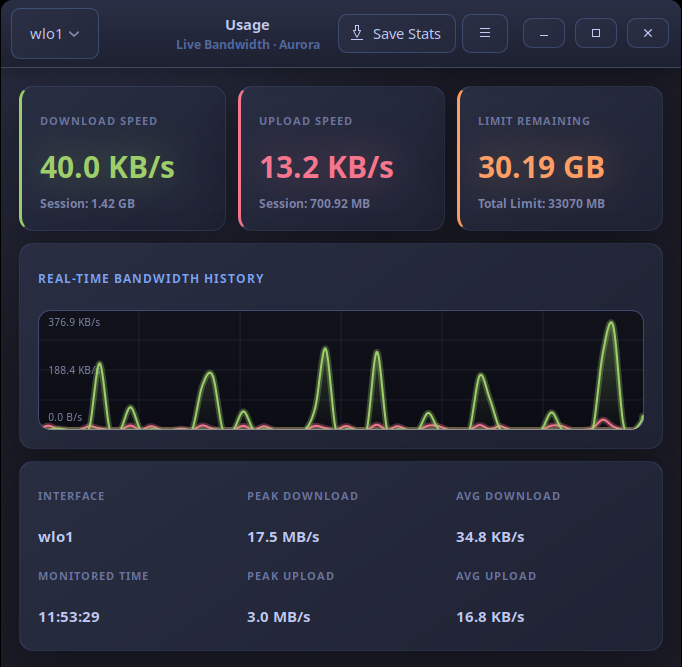

# Usage (Network Traffic Monitor)

[](LICENSE)
[](#)
[](#)
[](#)
[](#)

A real-time network traffic and bandwidth monitoring tool written in C and built with GTK+ 3. It displays current speeds, records session statistics, and draws a live graph of incoming and outgoing traffic. The interface is styled with a premium Tokyo Night dark theme.

---

## 📸 Screenshot

<div align="center">
  
  <br/>
  <em>Live bandwidth graph, real-time speeds, and session statistics — styled with Tokyo Night</em>
</div>

---

## Features

- **Real-Time Speed Tracking**: Shows current download and upload speeds with automatic formatting into human-readable units (B/s, KB/s, MB/s, GB/s).
- **Session Totals**: Tracks the total volume of data downloaded and uploaded (e.g., in MB or GB) since selecting the current network interface.
- **Live Bandwidth Graph**: A custom Cairo-drawn live graph displaying the last 60 seconds of traffic history. The graph uses color-coded areas (Green for Download, Pink/Red for Upload) with smooth vertical gradients and scales dynamically to match peak bandwidth.
- **Aggregated Statistics**: Displays session metadata:
  - Active network interface name
  - Monitored session time (HH:MM:SS format)
  - Peak download and upload speeds
  - Average download and upload speeds
- **Interface Selection**: Scans `/proc/net/dev` on startup to automatically discover all active network interfaces (e.g., `eth0`, `wlan0`, `lo`) and lets you switch between them via a dropdown in the HeaderBar.
- **Configuration Persistence**: Remembers your preferred interface across sessions by writing the selection to `~/.config/usage/usage.conf`.
- **Stay on Top**: Option in the menu button to keep the monitor floating above all other system windows.
- **PDF Report Generation**: Exports beautifully formatted network statistics reports. Saves stats to a LaTeX (`.tex`) file and automatically compiles it into a PDF using `pdflatex`. The generated report features Tokyo Night styled highlights, executive summaries, daily data usage tables, and 15, 30, and 60-minute statistical snapshots.
- **Tokyo Night CSS Styling**: Styled with a customized CSS stylesheet using the beautiful Tokyo Night color palette.

## Prerequisites

The application reads statistics directly from `/proc/net/dev` (Linux-specific filesystem) and relies on GCC, `make`, GTK+ 3, and `pdflatex` (from TeX Live) to compile reports.

### Debian / Ubuntu
```bash
sudo apt update
sudo apt install build-essential libgtk-3-dev pkg-config texlive-latex-base texlive-latex-recommended texlive-fonts-recommended texlive-latex-extra
```

### Fedora / Red Hat Enterprise Linux
```bash
sudo dnf groupinstall "Development Tools"
sudo dnf install gtk3-devel pkgconfig texlive-scheme-basic texlive-collection-latexrecommended
```

### Arch Linux
```bash
sudo pacman -S base-devel gtk3 pkgconf texlive-basic texlive-latexextra
```

## Compilation

Build the program from source using the provided `Makefile`:

```bash
# Compile and build the usage executable
make

# Run the program locally
./usage

# Clean compilation artifacts
make clean
```

## Installation

You can install the Usage monitor system-wide so it appears in your desktop environment's launcher:

```bash
# Install system-wide (requires root/sudo permissions)
sudo make install
```

This command will:
- Copy the executable to `/usr/local/bin`
- Install the application icon to `/usr/share/icons/hicolor/256x256/apps/`
- Install a desktop entry to `/usr/share/applications/`
- Update system icon and desktop databases.

To remove the application from your system:

```bash
# Uninstall system-wide (requires root/sudo permissions)
sudo make uninstall
```

## License

This project is licensed under the MIT License - see the [LICENSE](LICENSE) file for details.
```
